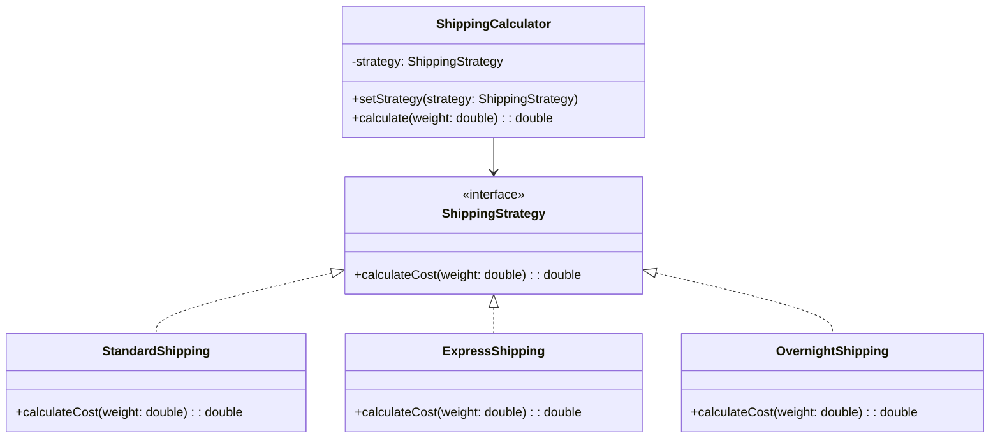

# Strategy Design Pattern - Shipping Calculator Example

A practical demonstration of the Strategy Design Pattern using a real-world shipping cost calculator example. This project shows how to implement flexible, maintainable, and extensible code using the Strategy pattern.

## 🎯 Problem Statement

A shipping company needs to calculate shipping costs based on different delivery methods:
- Standard Shipping (5-7 days)
- Express Shipping (2-3 days)
- Overnight Shipping (Next day delivery)

Each method has its own cost calculation algorithm based on package weight.

## 🏗️ Traditional vs Strategy Pattern Approach

### Traditional Approach (Problems)
```java
class ShippingCalculator {
    public double calculateCost(String method, double weight) {
        if (method.equals("Standard")) {
            return weight * 1.5;
        } else if (method.equals("Express")) {
            return weight * 2.0;
        }
        // More if-else statements...
    }
}
```
Problems:
- ❌ Hard to add new shipping methods
- ❌ Violates Open-Closed Principle
- ❌ Hard to maintain and test
- ❌ Violates Single Responsibility Principle

### Strategy Pattern Solution
```java
// Strategy Interface
interface ShippingStrategy {
    double calculateCost(double weight);
}

// Concrete Strategies
class StandardShipping implements ShippingStrategy {
    public double calculateCost(double weight) {
        return weight * 1.5;
    }
}

class ExpressShipping implements ShippingStrategy {
    public double calculateCost(double weight) {
        return weight * 2.0;
    }
}

// Context
class ShippingCalculator {
    private ShippingStrategy strategy;
    
    public void setStrategy(ShippingStrategy strategy) {
        this.strategy = strategy;
    }
    
    public double calculate(double weight) {
        return strategy.calculateCost(weight);
    }
}
```

## 🌟 Benefits

1. **Flexible & Extensible**
   - Easy to add new shipping methods
   - No modification of existing code needed
   - Strategies can be switched at runtime

2. **Maintainable**
   - Each strategy is isolated
   - Single Responsibility Principle followed
   - Clean and organized code structure

3. **Testable**
   - Easy to unit test each strategy
   - Strategies can be mocked for testing
   - Better code coverage

## 🚀 Usage

```java
public class Main {
    public static void main(String[] args) {
        ShippingCalculator calculator = new ShippingCalculator();
        double weight = 10.0;

        // Using Standard Shipping
        calculator.setStrategy(new StandardShipping());
        System.out.println("Standard Cost: $" + calculator.calculate(weight));

        // Switch to Express Shipping
        calculator.setStrategy(new ExpressShipping());
        System.out.println("Express Cost: $" + calculator.calculate(weight));
    }
}
```

## 📋 When to Use Strategy Pattern

Use the Strategy Pattern when:
- Multiple algorithms exist for a specific task
- You need to switch algorithms at runtime
- You want to isolate algorithm implementation from code that uses the algorithm
- A class has multiple behaviors that appear as conditional statements

## 🔄 Class Diagram



## 🛠️ Project Structure

```
src/
├── strategy/
│   ├── ShippingStrategy.java       # Strategy Interface
│   ├── StandardShipping.java       # Concrete Strategy
│   ├── ExpressShipping.java        # Concrete Strategy
│   └── OvernightShipping.java      # Concrete Strategy
├── calculator/
│   └── ShippingCalculator.java     # Context Class
└── Main.java                       # Client Code
```

## 🤝 Contributing

Feel free to contribute to this project:
1. Fork it
2. Create your feature branch (`git checkout -b feature/amazing-feature`)
3. Commit your changes (`git commit -m 'Add amazing feature'`)
4. Push to the branch (`git push origin feature/amazing-feature`)
5. Create a Pull Request

## 📝 License

This project is licensed under the MIT License - see the [LICENSE.md](LICENSE.md) file for details

## ✨ Further Reading

- [Strategy Pattern - RefactoringGuru](https://refactoring.guru/design-patterns/strategy)
- [Head First Design Patterns](https://www.oreilly.com/library/view/head-first-design/0596007124/)
